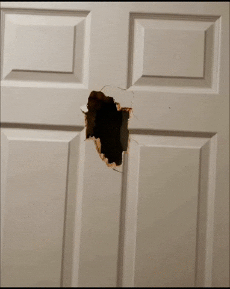

# 🦎 FloatlyGIF Browser Extension — Your GIF-Powered Web Companion

<p align="center">
  
  <br />
  <a href="https://github.com/GyaneshSamanta/Lizard-browser-extension/releases/latest">
    
  </a>
  <a href="https://github.com/GyaneshSamanta/Lizard-browser-extension/releases">
    
  </a>
</p>

<p align="center">
  <a href="https://buymeachai.ezee.li/GyaneshOnProduct">
    
  </a>
</p>

---

## 📖 Description

**Lizard Browser Extension** is a playful, interactive companion for your Chrome browser. It brings personality to your workspace by displaying animated GIFs that react to your behavior in real-time. Whether you're typing at lightning speed or taking a well-deserved break, your chosen companion (Lizard or Elmo) will be there to cheer you on or keep you company with unique, high-quality animations.

Designed to be non-intrusive yet delightful, this extension uses a "floating" overlay that stays out of your way while adding a touch of whimsy to every webpage you visit.

---

## ✨ Features

- **🚀 Floating Overlays** — Non-intrusive, premium animations that float above your content.
- **🦎 Smart Categories** — Choose between **Lizard** or **Elmo**, each with unique animation states.
- **⚡ Performance Tracking** — Real-time typing speed (WPM) detection that triggers high-energy animations.
- **🎁 Surprise Moments** — Fun inactivity triggers to keep the browsing experience alive.
- **🎨 Custom GIF Support** — Upload your own favorites and customize their size to fit your style.
- **💾 Persistent Settings** — Preferences saved automatically using `chrome.storage`.

---

## 🎮 How It Works

The extension features two built-in character sets, each with three distinct animation states based on your activity.

### **Character Showcases**

| State | Behavior | Lizard Preview | Elmo Preview |
| :--- | :--- | :---: | :---: |
| **Welcome** | Plays once when you load a new page. |  |  |
| **Normal Speed** | Default animation for standard browsing/typing. |  |  |
| **Fast Typing** | Triggers when your speed exceeds 40 WPM! |  |  |

---

## 🛠️ Installation Guide

### **For Users (Easy Setup)**
1. **Download the Release**: Go to the [Latest Release](https://github.com/GyaneshSamanta/Lizard-browser-extension/releases/latest) and download the `Source code (zip)`.
2. **Extract the Folder**: Unzip the downloaded file to a location on your computer.
3. **Open Chrome Extensions**: Type `chrome://extensions/` in your browser address bar.
4. **Enable Developer Mode**: Toggle the switch in the top-right corner.

   <br />
   
   
   
   <br />

5. **Load the Extension**: Click **Load unpacked** and select the folder you just extracted.
   
   <br />
   
   

---

### **For Developers (Contribution)**
If you want to modify the code or contribute to the project:

1. **Clone the Repository**:
   ```bash
   git clone https://github.com/GyaneshSamanta/Lizard-browser-extension.git
   ```
2. **Setup**: Follow steps 3-5 from the User Guide above, but select the cloned repository folder.
3. **Modify**: Make changes to `src/` and refresh the extension in the Chrome Extensions page to see updates.

---

## 🍵 Buy Me A Chai

If you're enjoying the 🦎 Lizard Browser Extension, consider supporting its development!

Any proceeds from this will go directly towards purchasing a **Chrome Web Store Extension License**, allowing me to publish this officially for everyone to enjoy with a single click.

[](https://buymeachai.ezee.li/GyaneshOnProduct)

---

## 👤 Author

**Gyanesh Samanta**

- [GitHub](https://github.com/GyaneshSamanta)
- [LinkedIn — Gyanesh on Product](https://www.linkedin.com/newsletters/gyanesh-on-product-6979386586404651008/)
- [Buy Me A Chai](https://buymeachai.ezee.li/GyaneshOnProduct)
