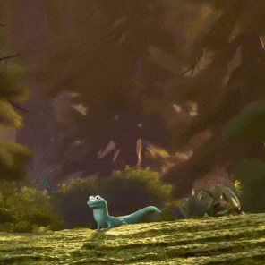
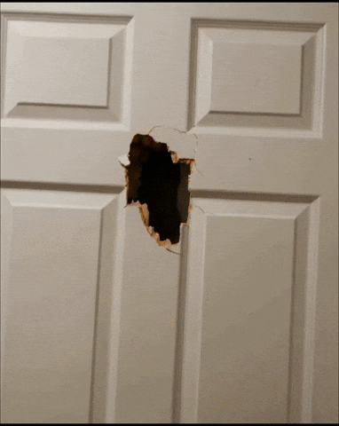
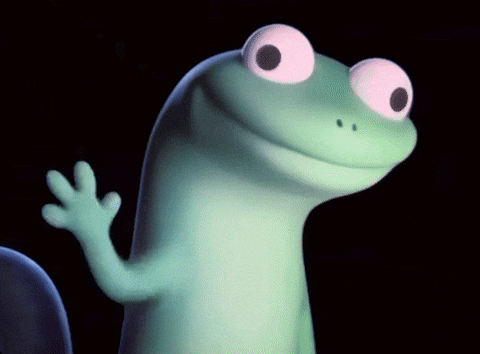
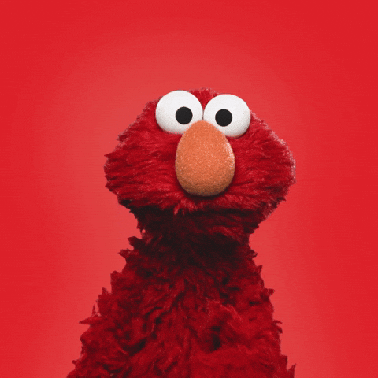

# FloatlyGIF — Your GIF-Powered Web Companion

> **A playful Chrome extension that floats a reactive GIF mascot on every page — and speeds up when you do.**

<p align="center">
  
</p>


[Latest release](https://github.com/GyaneshSamanta/FloatlyGIF-browser-extension/releases/latest) · [Buy Me A Chai](https://buymeachai.ezee.li/GyaneshOnProduct)

## About

- **What:** FloatlyGIF is a Chrome (Manifest V3) extension that overlays an animated, behavior-reactive GIF on every webpage. It tracks your typing speed and swaps animations between welcome, normal, and "you're typing fast" states.
- **Who:** A solo project by Gyanesh Samanta — designer, developer, and chief Lizard wrangler.
- **When:** Built and shipped in March 2026.
- **Where:** Personal product project, distributed as an unpacked Chrome extension while a Web Store license is in the works.
- **Why:** Browsing all day is lonely. A small mascot that reacts to *you* — your pace, your pauses — turns ordinary pages into something with a pulse, without getting in your way.

## The Story

Most browser extensions try to make you more productive. FloatlyGIF tries to make you smile. The premise is simple: pick a character (Lizard or Elmo), and as you browse, the extension floats a small GIF in the corner of every page. Open a fresh tab and you get a "welcome" animation. Settle into normal browsing and the mascot calms down. Crank past 40 WPM and it goes wild — a high-speed animation kicks in, rewarding the typing flow you didn't know you wanted celebrated.

Under the hood it's a tight Manifest V3 extension: a content script injects the floating overlay and watches keystroke timing, a service worker mediates state, and `chrome.storage` persists your character pick and custom uploads. Bring your own GIFs if Lizard and Elmo aren't your speed.

## Gallery

| State | Lizard | Elmo |
| :--- | :---: | :---: |
| Welcome |  |  |
| Normal |  |  |
| Fast typing (40+ WPM) |  |  |

---

## Tech Stack

- **Platform:** Chrome Extensions, Manifest V3
- **Language:** JavaScript (vanilla), HTML, CSS
- **APIs:** `chrome.storage`, `chrome.tabs`, `activeTab`, content scripts, service worker

## Repo Structure

```
FloatlyGIF-browser-extension/
├── manifest.json              # MV3 manifest
├── src/
│   ├── background.js          # Service worker
│   ├── content.js / content.css   # Floating overlay + WPM tracker
│   └── popup.html / popup.js / popup.css   # User UI
├── Assets/
│   ├── Lizard/                # Lizard animation states
│   ├── Elmo/                  # Elmo animation states
│   └── Logo/                  # Icons
└── Installation images/
```

## Getting Started

### For users

1. Download the [latest release zip](https://github.com/GyaneshSamanta/FloatlyGIF-browser-extension/releases/latest) and unzip it.
2. Visit `chrome://extensions/` and toggle **Developer mode** on (top right).

   

3. Click **Load unpacked** and select the unzipped folder.

   

### For developers

```bash
git clone https://github.com/GyaneshSamanta/FloatlyGIF-browser-extension.git
```

Then **Load unpacked** the cloned folder. Edit files under `src/` and hit the reload icon on the extensions page to see your changes.

## Contributing

Issues and PRs welcome. Good first contributions: new character packs, configurable WPM thresholds, dark-mode-aware overlay positioning.

## License

MIT — see manifest and project metadata. Mascot GIF assets are bundled for personal/non-commercial use.

## Credits

**Author:** Gyanesh Samanta — [GitHub](https://github.com/GyaneshSamanta) · [LinkedIn newsletter](https://www.linkedin.com/newsletters/gyanesh-on-product-6979386586404651008/) · [Buy Me A Chai](https://buymeachai.ezee.li/GyaneshOnProduct)

If you enjoy the extension, the chai jar funds the Chrome Web Store developer license so this can ship as a one-click install.
